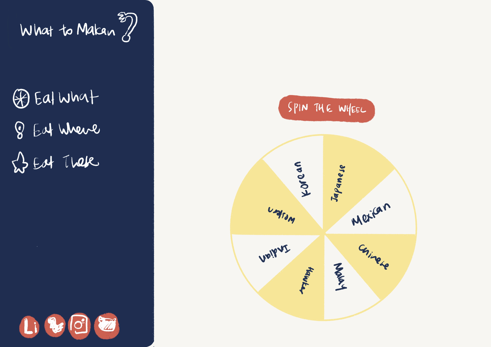
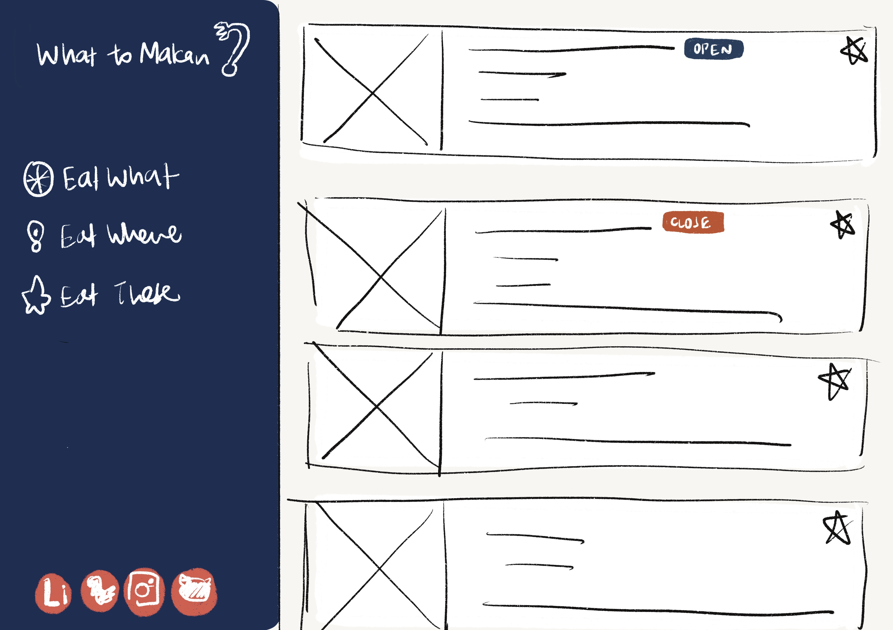
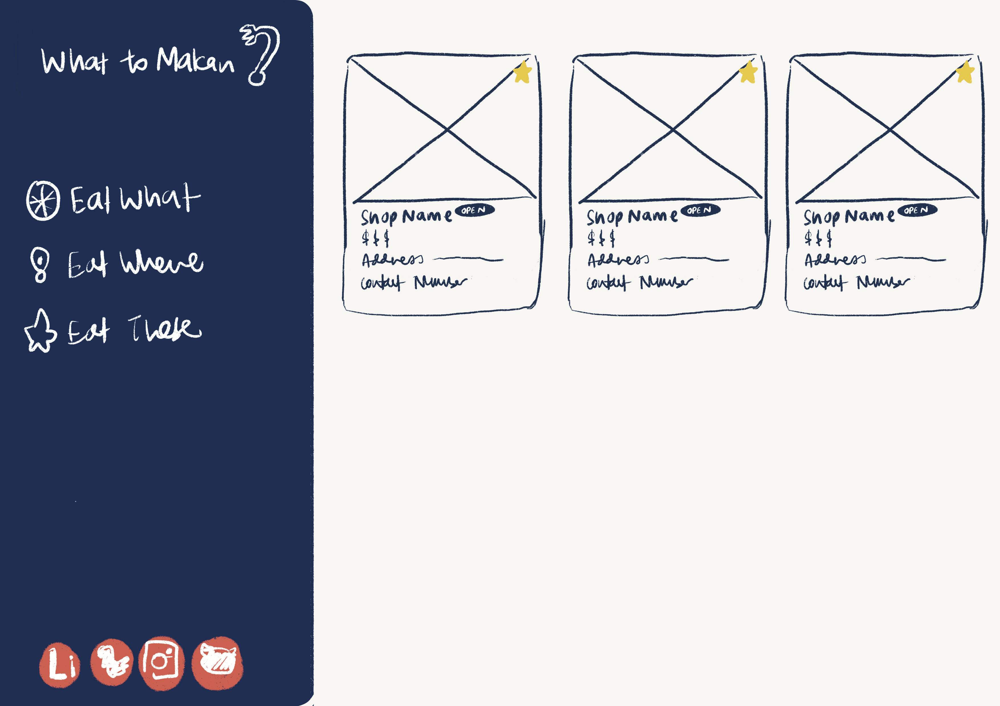
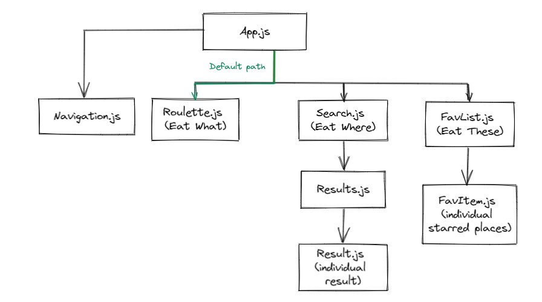

# What to Makan

This web application is built for everyone who has trouble deciding what to eat (because that's the problem I encounter everyday. Yes, everyday.)
Spin the wheel and let it decide for you what you should eat. Don't really like what's on the wheel? Simply highlight the options and type one that you would like.
You can also hop straight to the "Eat Where" tab to search for places to eat. Like this place that you will want to try next time? Just save it by clicking on the ⭐ button and you can access them under the "Eat These" tab.

### Technical Used

These are the cool friends that helped made my application possible

```
Built using:

- [React](https://reactjs.org/)
- [React Router](https://reactrouter.com/en/main)
- [tailwindcss](https://tailwindcss.com/)
- [react-icons](https://react-icons.github.io/react-icons/)
- [CORS Anywhere](https://github.com/Rob--W/cors-anywhere)

API used:

- [Yelp Fusion](https://fusion.yelp.com/)

Other resources:
-[Binni - Web Design for Development Center](https://dribbble.com/shots/18670878-Binni-Web-Design-for-Development-Center) - Design inspiration
-[Spinner Tutorial](https://www.youtube.com/watch?v=2plnsl8P2zE&t=1891s) - Helped made the roulette wheel come to life

```

### Wireframes

#### Eat What



#### Eat Where



#### Eat Where



## How It Works



#### App.js

This is where the main bulk of the code lies. All data such as search input, the results returned from the API and list of starred places are stored here and can be accessed through React context by other components.
As starred places are stored in the local storage, application will first check if there are any items previously starred and retrieves them.
When user search for something on the search bar, results will be lifted to App.js where API calls are made. Results returned from the call will be stored in an array and get displayed accordingly.

#### Navigation.js

This is the main navigation bar of the application and determines the path the application should be on when user clicks on any of the tab. Application will render the "Eat What" tab by default.

#### Roulette.js

This is the main component for "Eat What" tab. When users spin the wheel, the chosen option can be lifted to App.js as the search input to be used to call the API. The React Router's useHistory hook will then transit to the "Eat Where" tab.

#### Search.js and Results.js

This is where users can search for places to eat and results of the search will also be displayed here. When users submit their search query, the input will be lifted to App.js where the API call is done. After which Results.js component will retrieve the results from React Context and display them on the screen as individual Result.js component. A ⭐ button will also be rendered for each result to allow users to star places that they would like to try in the future. When users click on that button, it will add the result to the existing array of starred places within the context. By click on the star button again it will remove the place from the array. Changes made to this array will also trigger App.js to save the updated list on the local storage.

#### FavList.js

This is the component which will render starred places onto the screen when users navigate to the "Eat These" tab. Users can choose to remove any item on the list by hovering over the image of the item and click on the ❌ button.

## Future Development

- Adding a loading icon that runs when application is waiting for results returned from the API
- Building back-end for the application for calling of the API
